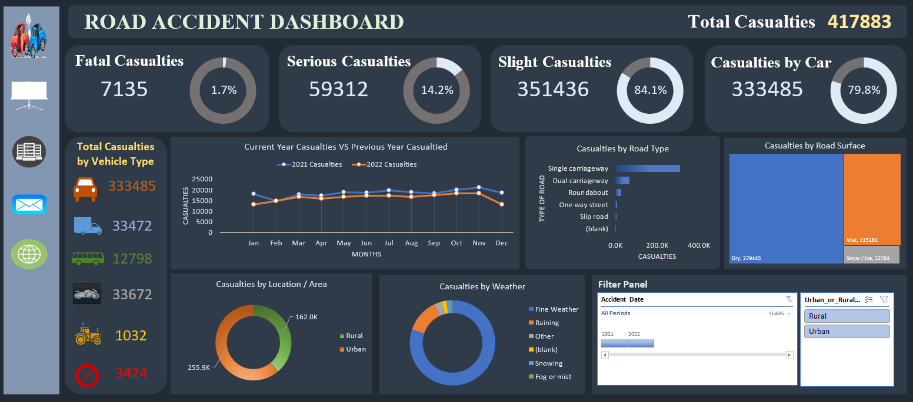

# 🚦 Road Accident Analysis Dashboard (Excel)

## 🧠 Project Overview

This project analyzes road accident data to evaluate casualty distribution, accident severity, vehicle involvement, road conditions, and environmental factors.

The objective was to design a KPI-driven interactive dashboard in Microsoft Excel to monitor accident trends, identify high-risk factors, and support data-driven road safety improvements.

The dashboard enables comparative analysis between years and provides insights into accident severity, road type, surface condition, and weather impact.

---

## 📁 Project Structure

The Excel workbook is organized into the following sheets:

1. **Road Accident Dataset**
   - Contains raw accident-level data.
   - Includes accident date, severity level, vehicle type, road type, road surface, weather condition, area (Urban/Rural), and number of casualties.

2. **Worksheet**
   - Cleaned and structured dataset prepared in table format.
   - Data transformation performed for pivot table analysis.

3. **KPI Sheet**
   - Multiple pivot tables created to calculate severity distribution, vehicle impact, yearly comparison, road conditions, and environmental factors.

4. **Dashboard Sheet**
   - Executive-level summary of accident statistics.
   - Year-over-year comparison.
   - Severity breakdown.
   - Vehicle-type analysis.
   - Road type & surface analysis.
   - Weather and area impact.
   - Interactive filter panel.

---

## 🛠 Tools & Techniques Used

- Microsoft Excel  
- Pivot Tables  
- Pivot Charts  
- Slicers (Interactive Filters)  
- Conditional Formatting  
- KPI Cards  
- Line Charts  
- Bar Charts  
- Donut Charts  
- Year-over-Year Analysis  

---

## 📊 Key KPIs Analyzed

### 🔹 1. Total Casualties

- Total Casualties: 417,883

**Insight:** Provides overall impact of road accidents and forms the baseline for all comparative analysis.

---

### 🔹 2. Casualties by Severity

- Fatal Casualties: 7,135 (1.7%)
- Serious Casualties: 59,312 (14.2%)
- Slight Casualties: 351,436 (84.1%)

**Insight:** Majority of accidents fall under slight severity, but fatal and serious cases represent critical areas for policy intervention.

---

### 🔹 3. Casualties by Vehicle Type

- Cars: 333,485 (79.8%)
- Vans: 33,472
- Motorcycles: 33,672
- Buses: 12,798
- Agricultural Vehicles: 1,032
- Others: 3,424

**Insight:** Cars contribute to the highest number of casualties, indicating higher traffic density and exposure risk.

---

### 🔹 4. Year-over-Year Casualty Comparison

- 2021 Casualties: 222,146
- 2022 Casualties: 195,737

**Insight:** Shows a decline in total casualties year-over-year, indicating possible improvements in road safety measures.

---

### 🔹 5. Casualties by Road Type

- Single Carriageway (Highest)
- Dual Carriageway
- Roundabout
- One Way Street
- Slip Road

**Insight:** Single carriageways account for the majority of casualties, highlighting potential need for infrastructure upgrades.

---

### 🔹 6. Casualties by Road Surface

- Dry Surface: 279,445
- Wet Surface: 115,261
- Snow/Ice: 22,781

**Insight:** While dry roads account for most casualties due to volume, wet and icy conditions significantly increase risk severity.

---

### 🔹 7. Casualties by Weather Condition

- Fine Weather (Highest)
- Raining
- Snowing
- Fog or Mist
- Other Conditions

**Insight:** Most accidents occur during fine weather due to higher traffic flow, not necessarily poor conditions.

---

### 🔹 8. Casualties by Location

- Urban Areas: 255.9K
- Rural Areas: 162.0K

**Insight:** Urban areas report higher casualty counts due to traffic density.

---

## 📈 Executive Summary KPIs

- 🚗 Total Casualties: 417,883  
- ⚠️ Fatal Casualties: 7,135  
- 🚦 Serious Casualties: 59,312  
- 🚘 Highest Vehicle Involvement: Cars  
- 🏙 Highest Impact Area: Urban  

---

## 📷 Dashboard Preview

---

## 💡 Business & Policy Recommendations

- Strengthen safety measures on single carriageways.
- Implement targeted urban traffic management strategies.
- Increase monitoring during wet and icy conditions.
- Improve car-driver safety awareness campaigns.
- Continue monitoring year-over-year casualty trends for policy evaluation.

---

## 🎯 Project Outcome

This project demonstrates:

- Strong Excel dashboard development  
- Public safety data analysis  
- Year-over-year trend comparison  
- Multi-dimensional KPI design  
- Data storytelling for policy and infrastructure improvement  

---

## 🚀 Skills Demonstrated

Excel | Data Analysis | Public Safety Analytics | KPI Reporting | Trend Analysis | Dashboard Design
